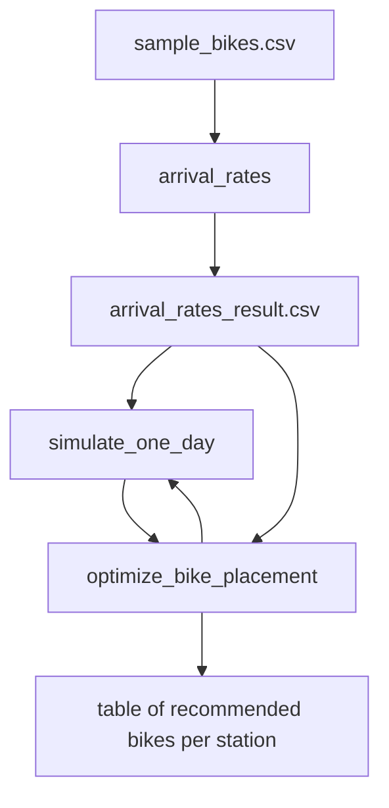

# Overview: Bike Placement Simulation & Optimization 

In this lab, we use historical bike usage data from a bikeshare system to optimize bike placement. 

Our goal is to place bikes in a way that will maximize user satisfaction. To do so, we have created a series of functions. 

Our first function assesses the rate of arrival to the stations of our bikeshare system by using historical data. 
Our next function uses the dataframe of arrival rates at each station created by our first function to 
simulate a day of bikeshare usage via a thinning process. 

Our third function calls upon our arrival rates data and our simulation to repeatedly simulate several days of bikeshare usage and then use that data to assess which stations are over or understocked with bikes. Then, the function uses this assessment to
redistribute bikes in order to maximize user satisfaction.

## Table of Contents
- [Data and Downloads](#Data-and-Downloads)
- [Function Diagram](#Function-Diagram)
- [Arrival Rates Function](#Arrival-Rates-Function)
- [Simulation Function](#Simulation-Function)
- [Optimization Function](#Optimization-Function)
- [Example Results](#Example-Results)

## Data and Downloads
### Dataset
The data we used is from CitiBike, and includes the start station, end station, start time, end time, and user type for customers over several days. The dataset is called "sample_bike.csv."

### Needed R Libraries
Our code relies on the library "tidyverse."

### Dataframes
Our arrival rates function produces a csv called "arrival_rates_result.csv." This dataset includes start_station, end_station, hour, and x-hat. x-hat is the average number of trips per day for each hour-station pair. To replicate our findings, this dataset can be used rather than re-running the arrival rates function. If new sample data should be used, rerun arrival rates and use the resulting new dataframe. 

## Function Diagram

## Arrival Rates Function
Housed in the file: arrival_rates.R

Function: arrival_rates()

Input: "sample_bike.csv." 

This function extracts the hour and day of each trip, excludes entries with missing customer types, groups by the start and end station pair and the hour of the day, and then returns x_hat. 

Output: a csv, which we have uploaded and named "arrival_rates_result.csv." 

## Simulation Function
Housed in the file: Simulation_Lela.R

Function: simulate_one_day()

Input: "arrival_rates_result.csv" 

The function simulates a single day of trips using bikeshare. It starts by identifying unique station pairs, and then looping through those pairs to identify the average number of trips from one station to another per hour. It also identifies the highest average per pair. While our time is less than 24 hours (as in, while we are still within the bounds of one simulated day), we thin our results (since our initial set of arrivals overestimates bikeshare usage) and store each arrival in a dataframe. Then, the function orders our trips by time, from the first trip of the day to the last. 

Output: a dataframe of simulated trips with start station, end station, hour, and time organized by time. 

## Optimization Function
Housed in the file: Optimization_Lela.R

Function: optimize_bike_placement()

Input: 
- "arrival_rates_result.csv"
- fleet_size (as in, the number of total bikes you have avaialble in your bikeshare system)
- n_days (as in, the number of days to simulate)
- seed (for replicability)

Goal: allocate our fleet across stations so that the number of riders who are unable to get a bike is minimized.

First, we initilaize all stations to have no bikes. Then, we simulate n_days of usage by calling upon our function simulate_one_day(). We identify the station with the highest count of unhappy riders --- those who arrived and could not get a bike --- and allocate 5 bikes to that station. We repeat this procees until all our bikes are allocated. 

Output: a table of reccomended bikes per station

## Example Results 
To view the results of three optimization examples, click the "results" folder. 
- For a fleet size of 200 bikes tested over 4 simulated days, view the table "fleet_size_200.csv" or plot "fleet_size_200.png"
- For a fleet size of 100 bikes tested over 7 simulated days, view the table "fleet_size_100.csv" or plot "fleet_size_100.png"
- For a fleet size of 50 bikes tested over 5 simulated days, view the table "fleet_size_50.csv" or plot "fleet_size_50.png"
